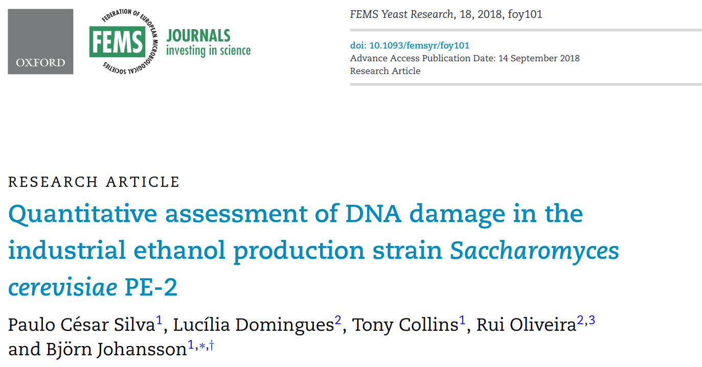

# Silva et al. 2018

This repository contains Jupyter notebooks describing cloning using
[Python](https://www.python.org),
[Jupyter notebooks](https://jupyter.org) and
[pydna](https://github.com/BjornFJohansson/pydna).

The notebooks and other files in this repository accompany the publication:

Silva, P. C., Domingues, L., Collins, T., Oliveira, R., & Johansson, B. (2018). Quantitative assessment of DNA
damage in the industrial ethanol production strain Saccharomyces cerevisiae PE-2. FEMS Yeast Research. https://doi.org/10.1093/femsyr/foy101
[PubMed](https://pubmed.ncbi.nlm.nih.gov/30219865)
[website](https://academic.oup.com/femsyr/article/18/8/foy101/5097783)

The notebooks can be visualized in a number of ways.
Each notebook (.ipynb) is accompanied by a HTML file with the same name but with an (.html)
extension. These can be opened in a web browser without installing any software.

The notebooks (.ipynb) can be opened in the browser through the nbviewer service
[here](http://nbviewer.jupyter.org/github/MetabolicEngineeringGroupCBMA/Cunha_et_al_2017/blob/master/notebooks/index.ipynb)
or directly in Github [here](notebooks/index.ipynb).

## Significant files:

### [The structure of the pRS6 plasmid](notebooks/The_structure_of_the_pRS6_plasmid_used_in_the_del_assay.ipynb)

This notebook contains a compilation of information on the construction of the pRS6 plasmid found in published literature.
The pRS6 plasmid was used to construct the original DEL cassette. View on [nbviewer](https://nbviewer.jupyter.org/github/MetabolicEngineeringGroupCBMA/dDEL/blob/master/The_structure_of_the_pRS6_plasmid_used_in_the_del_assay.ipynb).

### [pPS1 assembly](notebooks/pPS1_assembly.ipynb)

This notebook shows how the pPS1 plasmid was constructed. The pPS1 plasmid was the initial assembly of the dDEL cassette. View on [nbviewer](https://nbviewer.jupyter.org/github/MetabolicEngineeringGroupCBMA/dDEL/blob/master/pPS1_assembly.ipynb).

### [Integration of ddel cassette in HIS3 locus](notebooks/Integration_of_ddel_in_HIS3_locus.ipynb)

This notebook shows how a part of the pPS1 plasmid was integrated in the S. cerevisiae genome at the HIS3 locus.
View on [nbviewer](https://nbviewer.jupyter.org/github/MetabolicEngineeringGroupCBMA/dDEL/blob/master/Integration_of_ddel_in_HIS3_locus.ipynb).

Each notebook contain links (usually in the end) to the resulting sequences in Genbank flat file format.

These notebooks are tested on the github action build service.

This means that the notebook outputs are re-executed and compared with saved
results once per week to ensure [reproducibility](https://en.wikipedia.org/wiki/Replication_crisis).

If the badge below is green, all tests gave the expected results.

